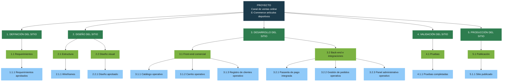
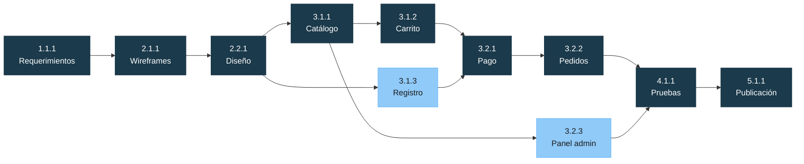
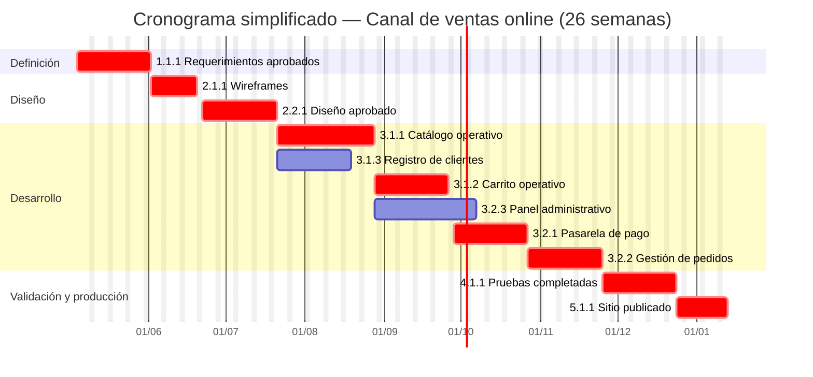

# Práctico Unidad 3 — Parte 1
## Caso: Implementación de una página Web para E-Commerce

**Asignatura:** Dirección de Proyectos  
**Unidad:** 3 — Alcance, Tiempo y Recursos  
**Proyecto:** Canal de ventas online para empresa mediana de artículos deportivos

---

## 1. Análisis del proyecto aprobado

El Directorio aprobó un canal de ventas online con **plazo de seis meses**, con el objetivo de llegar a todo el país **antes de la campaña navideña** (queda un mes de margen entre el go-live y Navidad). El Project Manager es el Director de Sistemas.

El Director Comercial resume el proyecto como *“solo una página web para vender productos”*. Esa lectura subestima el trabajo: el alcance aprobado no es un sitio institucional, sino un **sistema transaccional** (catálogo, carrito, pago, clientes, pedidos y backoffice). Cada uno de esos ítems es un entregable con dependencias, integraciones y pruebas propias.

El análisis de esta parte 1 construye la **línea base** del proyecto aprobado: qué se va a hacer, cómo se descompone, en qué orden, cuánto tarda el camino crítico y con qué perfiles. Esa línea base es el punto de partida para evaluar, más adelante, el impacto de cualquier cambio de alcance.

**Restricciones relevantes**

- Tiempo: 6 meses (~26 semanas). Navidad es inamovible.
- Alcance: solo los seis requerimientos aprobados por el Directorio.
- El PM concentra rol gerencial y dirección de sistemas (riesgo de disponibilidad).

**Supuestos**

- Existe un catálogo de productos (datos de sucursales) que puede digitalizarse.
- Se utilizará una pasarela de pago de terceros (no se desarrolla un procesador propio).
- El hosting y el dominio se contratan; no hay infraestructura on-premise que construir.
- Un referente del área comercial valida requerimientos, diseño y contenido.

---

## 2. Objetivo, alcance y entregables

### 2.1 Objetivo del proyecto

Poner en producción, en un plazo de seis meses, un canal de ventas online que permita a clientes de todo el país **consultar el catálogo, registrarse, comprar con tarjeta y hacer seguimiento de pedidos**, y al equipo interno **administrar productos y pedidos** desde un panel, a tiempo para la campaña navideña.

### 2.2 Alcance incluido (línea base aprobada)

| # | Requerimiento aprobado | Qué incluye (interpretación operativa) |
|---|------------------------|----------------------------------------|
| 1 | Catálogo de productos | Listado, ficha, búsqueda y categorías. Alta/edición desde el panel. |
| 2 | Carrito de compras | Agregar, modificar cantidades, eliminar y persistir el carrito. |
| 3 | Pago con tarjeta | Checkout e integración con pasarela; confirmación o rechazo del cobro. |
| 4 | Registro de clientes | Alta, login y datos básicos de cuenta. |
| 5 | Gestión de pedidos | Generación del pedido, estados (recibido / pagado / preparado / enviado) y consulta por el cliente. |
| 6 | Panel administrativo | ABM de productos, visualización de pedidos y clientes. |

### 2.3 Fuera de alcance (explícito)

Queda **fuera** de la línea base, aunque suele aparecer después como pedido comercial:

- Integración de stock en tiempo real con sucursales físicas.
- Logística, cotización de envíos y tracking de courier.
- Facturación electrónica y contabilidad.
- Medios de pago adicionales (transferencia, cuotas, billeteras).
- Aplicación móvil nativa.
- Motor de promociones, cupones o programa de fidelidad.
- Atención al cliente (chat, tickets) y gestión de devoluciones.
- SEO avanzado, analítica de marketing y campañas.

Cualquier incorporación de estos ítems es **cambio de alcance** y debe evaluarse contra plazo, costo y camino crítico antes de aceptarse.

### 2.4 Entregables principales

Los entregables de nivel 2 siguen el modelo de la nivelación (definición → diseño → desarrollo → validación → producción), adaptados a e-commerce:

1. **Definición del sitio** — requerimientos y reglas de negocio acordadas.
2. **Diseño del sitio** — estructura de navegación y diseño visual aprobado.
3. **Desarrollo del sitio** — canal de compra (front) y operación comercial (back).
4. **Validación del sitio** — pruebas del flujo completo de compra.
5. **Producción del sitio** — sitio publicado y operable.

---

## 3. EDT / WBS del proyecto

Descomposición del alcance hasta paquetes de trabajo. Se usan **tres niveles de desglose** bajo el proyecto (entregable → componente → paquete), igual que el ejemplo de nivelación.

| Nivel | Nombre | Significado |
|-------|--------|-------------|
| 1 | **Proyecto** | Objetivo del canal de ventas online. |
| 2 | **Entregables** | Productos principales que componen el alcance. |
| 3 | **Componentes** | Partes que constituyen cada entregable. |
| 4 | **Paquetes de trabajo** | Unidades medibles y controlables (se estiman, asignan y controlan). |



### 3.1 Diccionario breve de paquetes de trabajo

Los paquetes se redactan como **resultado terminado** (no como tarea), para poder verificar “hecho / no hecho”.

| Código | Paquete de trabajo | Criterio de completitud |
|--------|--------------------|-------------------------|
| 1.1.1 | Requerimientos aprobados | Documento de alcance y reglas de negocio firmado por Comercial y el PM. |
| 2.1.1 | Wireframes | Mapas de navegación y wireframes del flujo de compra validados. |
| 2.2.1 | Diseño aprobado | UI de catálogo, carrito, checkout, cuenta y panel, con visto bueno comercial. |
| 3.1.1 | Catálogo operativo | Productos visibles, fichas y búsqueda funcionando con datos reales de muestra. |
| 3.1.2 | Carrito operativo | El usuario agrega, modifica y elimina ítems; el carrito persiste en sesión/cuenta. |
| 3.1.3 | Registro de clientes operativo | Alta, login y recuperación básica de acceso. |
| 3.2.1 | Pasarela de pago integrada | Cobro con tarjeta en ambiente de prueba, con casos de éxito y rechazo. |
| 3.2.2 | Gestión de pedidos operativa | Pedido creado al pagar; estados administrables; consulta por el cliente. |
| 3.2.3 | Panel administrativo operativo | ABM de productos y gestión de pedidos/clientes por un operador interno. |
| 4.1.1 | Pruebas completadas | Flujo extremo a extremo (alta → catálogo → carrito → pago → pedido) certificado. |
| 5.1.1 | Sitio publicado | Producción activa, DNS, certificado, backup y pase de soporte al equipo interno. |

---

## 4. Dependencias entre actividades

Las actividades de planificación son los **paquetes de trabajo**. El tipo predominante es **Fin–Inicio (FS)**: no arranca el sucesor hasta que termina el predecesor.

| De | A | Tipo | Justificación |
|----|---|------|----------------|
| 1.1.1 Requerimientos | 2.1.1 Wireframes | FS | Sin reglas de negocio no hay estructura de pantallas. |
| 2.1.1 Wireframes | 2.2.1 Diseño visual | FS | El diseño visual se aplica sobre la estructura ya acordada. |
| 2.2.1 Diseño aprobado | 3.1.1 / 3.1.3 / 3.2.3 | FS | El desarrollo espera UI aprobada para no retrabajar. |
| 3.1.1 Catálogo | 3.1.2 Carrito | FS | El carrito opera sobre productos del catálogo. |
| 3.1.1 Catálogo | 3.2.3 Panel admin | FS | El ABM administra el mismo catálogo que ve el cliente. |
| 3.1.2 Carrito + 3.1.3 Registro | 3.2.1 Pago | FS | El checkout cobra un carrito de un cliente identificado. |
| 3.2.1 Pago | 3.2.2 Pedidos | FS | El pedido nace de un pago confirmado. |
| 3.2.2 Pedidos + 3.2.3 Panel | 4.1.1 Pruebas | FS | Se prueba el flujo completo, no módulos aislados. |
| 4.1.1 Pruebas | 5.1.1 Publicación | FS | No se publica un sitio sin certificación del flujo de compra. |

**Paralelismo posible (no crítico):** el registro de clientes (3.1.3) y el panel administrativo (3.2.3) pueden avanzar en paralelo al catálogo/carrito, una vez aprobado el diseño. Eso reduce calendario, pero **no acorta el camino crítico**, que pasa por catálogo → carrito → pago → pedidos.



En azul oscuro: camino crítico. En azul claro: actividades con holgura.

---

## 5. Cronograma simplificado y camino crítico

**Horizonte:** 6 meses = 26 semanas. Semana 0 = arranque. Semana 26 = sitio publicado. Queda ~1 mes hasta Navidad para carga de catálogo navideño, difusión y correcciones menores (fuera del proyecto de construcción, pero dentro de la ventana comercial).

### 5.1 Duraciones y red

| ID | Paquete | Duración | Predecesoras | ES | EF | LS | LF | Holgura |
|----|---------|----------|--------------|----|----|----|----|---------|
| A | 1.1.1 Requerimientos aprobados | 3 sem | — | 0 | 3 | 0 | 3 | **0** |
| B | 2.1.1 Wireframes | 2 sem | A | 3 | 5 | 3 | 5 | **0** |
| C | 2.2.1 Diseño aprobado | 3 sem | B | 5 | 8 | 5 | 8 | **0** |
| D | 3.1.1 Catálogo operativo | 4 sem | C | 8 | 12 | 8 | 12 | **0** |
| E | 3.1.2 Carrito operativo | 3 sem | D | 12 | 15 | 12 | 15 | **0** |
| F | 3.1.3 Registro operativo | 3 sem | C | 8 | 11 | 12 | 15 | 4 |
| G | 3.2.1 Pasarela de pago | 3 sem | E, F | 15 | 18 | 15 | 18 | **0** |
| H | 3.2.2 Gestión de pedidos | 3 sem | G | 18 | 21 | 18 | 21 | **0** |
| I | 3.2.3 Panel administrativo | 4 sem | C, D | 12 | 16 | 17 | 21 | 5 |
| J | 4.1.1 Pruebas completadas | 3 sem | H, I | 21 | 24 | 21 | 24 | **0** |
| K | 5.1.1 Sitio publicado | 2 sem | J | 24 | 26 | 24 | 26 | **0** |

ES/EF = inicio/fin más temprano. LS/LF = inicio/fin más tardío. Holgura = LS − ES.

**Duración del proyecto:** 26 semanas.

### 5.2 Camino crítico

```
A → B → C → D → E → G → H → J → K
```

**Requerimientos → Wireframes → Diseño → Catálogo → Carrito → Pago → Pedidos → Pruebas → Publicación**

Duración: 3 + 2 + 3 + 4 + 3 + 3 + 3 + 3 + 2 = **26 semanas**.

Cualquier atraso en este encadenamiento **desplaza la fecha de publicación** y come el mes de colchón previo a Navidad. El registro (F) y el panel (I) pueden retrasarse 4 y 5 semanas respectivamente sin mover el fin del proyecto, siempre que no se vuelvan predecesores de otra actividad crítica.

### 5.3 Vista por meses

| Paquete | M1 | M2 | M3 | M4 | M5 | M6 |
|---------|----|----|----|----|----|-----|
| 1.1.1 Requerimientos | ███ | | | | | |
| 2.1.1 Wireframes | ░██ | | | | | |
| 2.2.1 Diseño aprobado | | ███ | | | | |
| 3.1.1 Catálogo | | ░░ | ██ | | | |
| 3.1.3 Registro | | ░░ | ██ | | | |
| 3.1.2 Carrito | | | ░ | ██ | | |
| 3.2.3 Panel admin | | | ░ | ██ | | |
| 3.2.1 Pago | | | | ░ | ██ | |
| 3.2.2 Pedidos | | | | | ███ | |
| 4.1.1 Pruebas | | | | | ░ | ██ |
| 5.1.1 Publicación | | | | | | ░██ |

M1–M6 = meses 1 a 6. Las celdas marcadas indican ocupación aproximada (no escala exacta de semanas).



*Las fechas del Gantt son ilustrativas: arranque a principios de mayo, publicación a fines de octubre y Navidad en diciembre (un mes de margen comercial). El caso se gestiona en semanas; el calendario civil solo ayuda a ver la secuencia.*

### 5.4 Lectura gerencial del cronograma

- El proyecto **no tiene holgura total**: 26 semanas de trabajo crítico en 26 semanas de plazo.
- El cuello de botella no es el panel ni el registro; es el **flujo de compra** (catálogo → carrito → pago → pedido).
- Un cambio de alcance que alargue diseño, catálogo, pago o pruebas no se absorbe: o se recorta otra cosa, o se mueve Navidad (inviable), o se baja calidad.
- Por eso la frase “solo una página web” es riesgosa: cualquier pedido extra (stock, envíos, cupones) se inserta sobre un camino crítico ya saturado.

---

## 6. Asignación de perfiles

Se asignan perfiles a **grupos de actividades** (componentes de la EDT), no a cada tarea suelta. El equipo es el de una empresa mediana: reducido, con algunos roles combinables, pero sin omitir competencias.

| Grupo de actividades | Perfiles | Dedicación | Justificación |
|----------------------|----------|------------|---------------|
| **Dirección del proyecto** (toda la EDT) | Project Manager (Director de Sistemas) | Parcial, permanente | Integra alcance, plazo y recursos; es el único rol con autoridad formal ante el Directorio. Riesgo: si el día a día de sistemas lo absorbe, el control del camino crítico se debilita. |
| **1. Definición** (1.1.1) | Analista de negocio + referente comercial | Alta en M1 | El analista traduce el pedido comercial (“vender online”) a reglas verificables. El referente comercial es dueño del catálogo, precios y políticas de venta; sin él los requerimientos no son aprobables. |
| **2.1 Estructura** (2.1.1) | UX Designer | Alta en M1–M2 | Un e-commerce se juega en el flujo de compra. El UX define arquitectura de información y wireframes de catálogo, carrito y checkout; no es un rol decorativo. |
| **2.2 Diseño visual** (2.2.1) | UI Designer | Alta en M2 | Identidad de marca deportiva, consistencia visual y diseño responsive. Puede ser la misma persona que UX en una pyme, pero la competencia es distinta de desarrollo. |
| **3.1 Front-end comercial** (3.1.1, 3.1.2, 3.1.3) | Desarrollador front-end | Alta en M3–M4 | Implementa catálogo, carrito y registro según el diseño aprobado. Es trabajo de interfaz e integración con APIs, no de “armar una landing”. |
| **3.2 Back-end e integraciones** (3.2.1, 3.2.2, 3.2.3) | Desarrollador back-end | Alta en M3–M5 | Modelo de datos, pedidos, panel y servicios. El pago no lo desarrolla internamente, pero el back-end orquesta la pasarela, confirma cobros y genera el pedido. |
| **3.2.1 Pasarela de pago** | Back-end + referente de seguridad / pagos | Puntual en M4–M5 | El cobro con tarjeta implica PCI, ambientes sandbox/producción, tokens y conciliación. Un error aquí es fallo de negocio, no un bug estético. No se asigna a un perfil genérico “web”. |
| **4. Validación** (4.1.1) | QA / tester + referente comercial | Alta en M5–M6 | El QA diseña casos (alta, compra, rechazo de tarjeta, pedido). Comercial valida que el flujo sea vendible, no solo “técnicamente ok”. |
| **5. Producción** (5.1.1) | Perfil de infraestructura / DevOps (interno o proveedor de hosting) + PM | Alta en M6 | Publicación, HTTPS, backups, monitoreo mínimo y rollback. El PM cierra el proyecto y transfiere operación. |
| **Contenido del catálogo** (apoya 3.1.1 y 5.1.1) | Referente comercial / asistente de producto | Recurrente M3–M6 | Sin fotos, precios y stock inicial el sitio puede estar “desarrollado” y no ser vendible. Es trabajo del negocio, no del equipo técnico. |

### 6.1 Equipo mínimo propuesto

| Rol | Personas | Observación |
|-----|----------|-------------|
| Project Manager | 1 (Director de Sistemas) | No full-time; hay que proteger horas de gobierno del proyecto. |
| Analista de negocio | 1 | Puede ser interno de sistemas o consultor por los primeros dos meses. |
| UX/UI | 1 | Rol combinado, típico en empresa mediana. |
| Desarrollador front-end | 1 | |
| Desarrollador back-end | 1 | Incluye integración de pasarela. |
| QA | 1 | Entra fuerte desde el mes 4; antes, apoyo puntual. |
| Infraestructura / hosting | 0,25 | Interno de sistemas o contrato con el proveedor. |
| Referente comercial (Product Owner de facto) | 1 | No es informático; es el cliente interno. |

**Por qué no alcanza “un programador y un diseñador”:** el camino crítico cruza definición, diseño, cuatro módulos transaccionales, pruebas y publicación. Un solo desarrollador serializaría catálogo, carrito, pago, pedidos y panel, y el plazo de 26 semanas no cierra. Front y back en paralelo es la condición para que registro y panel usen la holgura mientras el flujo de compra avanza por el camino crítico.

---

## 7. Síntesis

El proyecto aprobado **no es una página web**: es un canal transaccional con seis entregables funcionales, descompuestos en once paquetes de trabajo. La EDT de tres niveles deja visible esa complejidad; el cronograma muestra que el plazo de seis meses coincide exactamente con el camino crítico (26 semanas). No hay colchón interno.

La implicancia para la dirección del proyecto es directa: **cualquier ampliación de alcance** (stock, envíos, promociones, otro medio de pago) se come el único mes que queda hasta Navidad, o empuja el go-live dentro de la campaña. El control de cambios no es burocracia: es lo que permite llegar a diciembre con un canal vendible, aunque sea el mínimo aprobado, en lugar de un alcance más ambicioso e incompleto.
